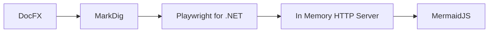

# DocFx MermaidJS

## Mission Statement

To provide build time generation of MermaidJS diagrams in DocFX generated sites or PDF documents.

## Project Details

| | |
| ------------ | ------------- |
| Project Type | Nuget Package |
| Project Status | Active Development |
| Release Status | Published |
| Language | C# |
| License | MIT |
| Build Status | 
| Nuget |  |
| Code Coverage |  |
| Code Quality |  |

## Introduction

At the time this project was started DocFX had no MermaidJS support. As of 2023-05 there is view time support in the modern HTML template however

* It requires the content to be re-generated every visit, requiring Javascript.
* The DocFX to PDF rendering of the content misses out the diagrams.

## High Level Design

The project embeds the MermaidJS files into an in memory HTTP server that is used by the MarkDig plugin to generate the diagrams at compile time. The diagrams are embedded as PNG images into the page as the DocFX plugin model does not lend itself to modifying the document object graph.

## Getting Started

TODO

## References

* [DocFX](https://dotnet.github.io/docfx/)
* [MermaidJS](https://mermaid-js.github.io/mermaid/#/)
* [Playwright for .NET](https://playwright.dev/dotnet/)
