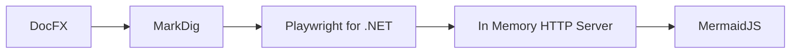

# DocFx MermaidJS

## Mission Statement

To provide build time generation of MermaidJS diagrams in DocFX generated sites or PDF documents.

## Project Details

| | |
| ------------ | ------------- |
| Project Type | Nuget Package |
| Project Status | Active Development |
| Release Status | Published |
| Language | C# |
| License | MIT |
| Build Status |  |
| Nuget |  |
| Code Coverage |  |
| Code Quality |  |

## Introduction

At the time this project was started DocFX had no MermaidJS support. As of 2023-05 there is view time support in the modern HTML template however:

* It requires the content to be re-generated every visit, requiring Javascript.
* The DocFX to PDF rendering of the content misses out the diagrams.

## Limitations

* v2 of this plug in only supports MarkDig, due to DocFx 2.60 deprecating support for DFM. The plug in model is significantly different in v2.60 as well and requires you to have your own application to run the DocFX generation.
* Currently only HTML generation is supported, PDF is not supported due to a breaking change in DocFX 2.60 which I'm looking to resolve with a PR.
* Only inline PNG is supported, this is due to a limitation in the plug in model and adding new files to the file cache on the fly. I may revisit this in future. The plug in itself exposes SVG data if you want to play with it.

## Getting Started

### 1. Create a console application (or similar)
### 2. Add a nuget package reference to "Dhgms.DocFX.Mermaid.Plugin" in your console application.
### 3. Add the following initialisation

```cs
var options = new BuildOptions
{
    // Enable MermaidJS markdown extension
    ConfigureMarkdig = pipeline => pipeline.UseMermaidJsExtension(new MarkdownContext())
};
await Docset.Build("docfx.json", options);
```

You can see an example of this in the console application in this documentation repository (github.com/dpvreony/documentation/tree/main/src/docfx_project)](https://github.com/dpvreony/documentation/tree/main/src/docfx_project)

Notes:

You can adjust the settings by viewing the detailed documentation.

### 4. Adding a diagram

In your markdown files add a code block with a mermaid descriptor like so:

````

````

Then you can run the build and you should see the image output in place of the mermaid markdown syntax.


## High Level Design

The project embeds the MermaidJS files into an in memory HTTP server that is used by the MarkDig plugin to generate the diagrams at compile time. The diagrams are embedded as PNG images into the page as the DocFX plugin model does not lend itself to modifying the document object graph.



## References

* [DocFX](https://dotnet.github.io/docfx/)
* [MermaidJS](https://mermaid-js.github.io/mermaid/#/)
* [Playwright for .NET](https://playwright.dev/dotnet/)
