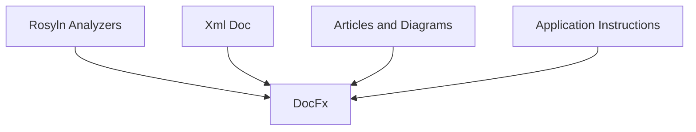
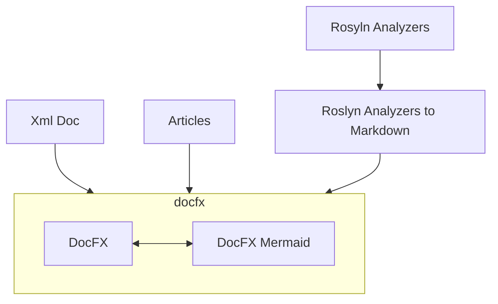

# DPVreony Documentation

## Introduction

This project has the following objectives

* To give a centralised documentation site for my open source projects
* To provide a proof of what organisations can do for centralised knowledge management along with processes to pull different types of documentation source together.

## High Level Design

There are essentially 4 types of content that need to flow into the system.

* .NET XML Documentation is supported natively in DocFX.
* Mermaid Diagrams are generated per site visit by the default DocFX template, but we have created a Nuget package to extend DocFX and generate them at build time.
* Roslyn Analyzers need custom processing to produce the necessary markdown\ html to be processed by DocFX.
* The Github Actions CI\CD workflow needs to handle the generation and deployment of all the content.

## Low Level Design

### Enrichment processes

#### Roslyn Analyzers to Markdown

A dotnet tool to load an analyzer assembly to:
* Produce an index of all analyzers.
* Produce a summary file for each analyzer.

### Maintenance processes

#### Keeping nuget packages up to date

This can be handled by Renovate.

#### Keeping track of new packages that are created

We can create a tool to track missing packages by author name.
